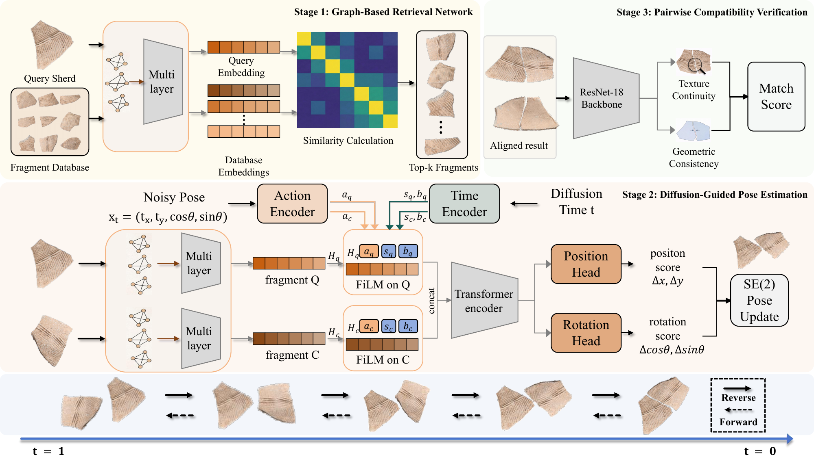

# SherdFusion

SherdFusion is a multi-stage pipeline for pottery sherd matching and assembly. The project combines graph-based retrieval, diffusion-guided pose estimation, and learning-based pairwise verification to recover plausible fragment matches from large candidate spaces.


## Overview

SherdFusion is organized into three core stages:

- **Stage 1: Retrieval**
  Learn graph-based fragment embeddings and retrieve Top-\(K\) candidate matches.
- **Stage 2: Pose Estimation**
  Align candidate fragment pairs using a diffusion model in SE(2).
- **Stage 3: Pairwise Compatibility**
  Verify whether a candidate assembly is compatible using an image-based binary classifier.

In addition, the repository includes a gold-standard end-to-end evaluation branch and dataset preparation utilities.

## Pipeline



Overview of the proposed *SherdFusion* pipeline. Stage 1 performs graph-based fragment retrieval using a shared graph encoder to compute similarity and obtain Top-\(K\) candidates. Stage 2 conducts diffusion-guided pose estimation, where candidate pairs are aligned through iterative denoising in SE(2) space to produce geometrically consistent multi-hypothesis results. Finally, Stage 3 utilizes a learning-based pairwise compatibility verification network to assess the validity of the assembled fragment pairs and filter out incorrect matches.


## Repository Structure

```text
SherdFusion/
├── dataset_builder/
├── dataset_gold_standard/
├── gold_standard_end_to_end/
├── page/
├── stage_1_retrieval_network/
├── stage_2_pose_estimation/
├── stage_3_pairwise_compatibility/
├── environment.yml
└── README.md
```

### Main Components

- `dataset_builder/`
  Utilities for feature extraction and dataset preparation from external fragment data.
- `dataset_gold_standard/`
  Gold-standard benchmark assets, including fragment images and annotations.
- `gold_standard_end_to_end/`
  End-to-end evaluation scripts for curated benchmark pairs.
- `page/`
  Static assets used in the project overview.
- `stage_1_retrieval_network/`
  Retrieval training, evaluation, and Top-\(K\) visualization.
- `stage_2_pose_estimation/`
  Diffusion-based pair alignment training and evaluation.
- `stage_3_pairwise_compatibility/`
  Pairwise verification from exterior/interior image pairs.

## Installation

The recommended setup uses the Conda environment provided in [environment.yml](environment.yml).

```bash
conda env create -f environment.yml
conda activate sherdfusion
```

If you already have a custom PyTorch environment, make sure the following core dependencies are available:

- `pytorch`
- `torchvision`
- `torch-geometric`
- `numpy`
- `pandas`
- `matplotlib`
- `scikit-learn`
- `pillow`
- `tqdm`
- `shapely`
- `opencv-python`
- `timm`

## Data

Part of the Daxinzhuang 18k sample dataset and part of the simulated dataset are available from the following Google Drive link:

- https://drive.google.com/file/d/15PvheiSr2btC59dsixITTOuPgracJlAz/view?usp=sharing

After downloading, place the data in your preferred local location and update the corresponding script arguments or default dataset paths as needed.

## Getting Started

### 1. Build or prepare datasets

Use `dataset_builder/` or your own preprocessing pipeline to prepare the external data required by each stage.

### 2. Train Stage 1 retrieval

Main entry point:

- `stage_1_retrieval_network/search.py`

Stage 1 trains graph-based fragment embeddings and evaluates retrieval metrics such as `R@5`, `R@10`, `NDCG@5`, and `NDCG@10`.

### 3. Train Stage 2 pose estimation

Main entry point:

- `stage_2_pose_estimation/train/train_pair.py`

Stage 2 trains a diffusion model for pairwise rigid alignment and saves checkpoints plus train/validation visualizations.

### 4. Evaluate Stage 2 pose estimation

Main entry point:

- `stage_2_pose_estimation/test/test.py`

The evaluation script reconstructs the saved validation split and reports recall-oriented metrics such as `Recall`, `AEtrans`, `AErot`, and `Avg. IoU`.

### 5. Train Stage 3 pairwise compatibility

Main entry points:

- `stage_3_pairwise_compatibility/merge_labels.py`
- `stage_3_pairwise_compatibility/train.py`
- `stage_3_pairwise_compatibility/infer.py`

Stage 3 trains an image-based binary classifier for pair compatibility and supports batch inference on candidate exterior/interior pairs.

### 6. Run gold-standard end-to-end evaluation

Main entry point:

- `gold_standard_end_to_end/`

This branch combines retrieval and pose verification on the curated benchmark data.

